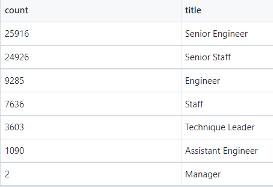

# Pewlett-Hackard-Analysis
## Overview
The Pewlett Hackard has tasked us with determining the number of current employees eligible for retirement as well as identifying employees who qualify for particiaption in their mentorship program. The company has provided several comma-seperated value (csv) with various data such as employees names, numbers, dates of birth, etc. We imported these files into pgAdmin (a development platform for PostGreSQL) to create and query databases which allowed us to provide the information requested. To help visualize the creation of the database, we first used quickDBD to create a schematic 
## Tools
[pgAdmin4](pgadmin.org) 
[PostgreSQL](www.postgresql.org) 
[quickDBD](https://www.quickdatabasediagrams.com/) 
 
The company provided the following csv files: 
[employees.csv](./Data/employees.csv) 
[departments.csv](./Data/departments.csv) 
[dept_emp.csv](./Data/dept_emp.csv) 
[dept_manager.csv](./Data/dept_manager.csv) 
[titles.csv](./Data/titles.csv) 
[salaries.csv](./Data/salaries.csv) 
 
A schematic of the contents and relationships between the given csv files is shown below:

[Database Schematic](EmployeeDB.png) 

## Results
### Retiring Employees by Title
A csv file of the number of retiring employees arranged by title can be found 
[here](./Data/retiring_titles.csv) and is shown below:

## Summary