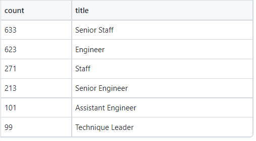

# Pewlett-Hackard-Analysis
## Overview
The Pewlett Hackard has tasked us with determining the number of current employees eligible for retirement as well as identifying employees who qualify for particiaption in their mentorship program. The company has provided several comma-seperated value (csv) with various data such as employees names, numbers, dates of birth, etc. We imported these files into pgAdmin (a development platform for PostGreSQL) to create and query databases which allowed us to provide the information requested. To help visualize the creation of the database, we first used quickDBD to create a schematic 
## Tools
[pgAdmin4](pgadmin.org) 
[PostgreSQL](www.postgresql.org) 
[quickDBD](https://www.quickdatabasediagrams.com/) 
 
The company provided the following csv files: 
[employees.csv](./Data/employees.csv) 
[departments.csv](./Data/departments.csv) 
[dept_emp.csv](./Data/dept_emp.csv) 
[dept_manager.csv](./Data/dept_manager.csv) 
[titles.csv](./Data/titles.csv) 
[salaries.csv](./Data/salaries.csv) 
 
A schematic of the contents and relationships between the given csv files is shown below:

[Database Schematic](EmployeeDB.png) 

## Results and Summary
### Retiring Employees by Title
A csv file of the number of retiring employees arranged by title can be found 
[here](./Data/retiring_titles.csv) and is shown below:
  
With so many Senior Engineers eligible for retirement (almost 26,000), it would most likely be prudent to not only look into recruiting new engineers to join the company, but perhaps specifically more experienced engineers.  The loss of so many higher-level engineers could prove to be very costly to the company. 
Furthermore, with the possible exit of so many senior engineers, the retention of lower-level engineers will be critical, as they will be the ones to replace those leaving for retirement. This is compounded by having another ~9,000 Engineers also eligible for retirement. Without sufficient retention of those already in the company, a major "brain drain" will occur.  
The situation will be the same for Senior Staff members (~25,000 eligible for retirement). The retention of those below the senior level should be a major focus over the next several years, especially with roughly 7600 regular staff eligible. 
For both the engineers and staff positions, significant recruiting will need to be done in order to fill the approximately 35,000 engineering and 32,000 staff positions that will be vacant in the coming years due to retirement. 

### Mentorship Eligibility
A csv file of the employees eligible for the mentorship program can be found [here](./Data/mentorship_eligibility.csv) and the data arranged by title is shown below:
  
With the need to add tens of thousands of engineers and staff, the low numbers of qualifying mentors is deeply concerning.  The mentorship program would be a vital part of employee retention (critical due to the upcoming "silver tsunami") and would need to be properly staffed. Perhaps expanding the eligible age range for the program would allow for proper staffing.
